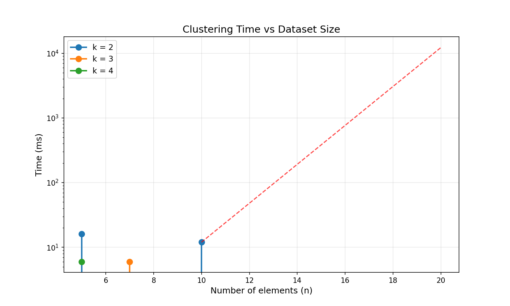

# Отчет по лабораторной работе №7: Разделяй и властвуй

**Студент:** Образцов Максим  
**Группа:** J3119

---

## 1. Теоретическая часть

### Описание класса NP-полных задач
**NP-полные задачи** (Nondeterministic Polynomial-time complete) — это класс наиболее сложных комбинаторных задач, для которых на данный момент не найдено эффективных (полиномиальных) алгоритмов решения. Они обладают следующими ключевыми свойствами:
1. **Полиномиальная проверяемость:** Если дано какое-то готовое решение (сертификат), проверить его корректность и вычислить метрику можно быстро — за полиномиальное время $O(n^c)$.
2. **Экспоненциальный поиск:** Поиск самого решения в худшем случае требует полного перебора всех возможных состояний, что приводит к экспоненциальной или факториальной временной сложности (например, $O(k^N)$ или $O(N!)$).
3. **Сводимость:** Любая задача из класса NP может быть сведена к любой NP-полной задаче за полиномиальное время. Это означает, что если будет найден полиномиальный алгоритм хотя бы для одной NP-полной задачи, то равенство $P = NP$ будет доказано, и все задачи этого класса станут решаемыми за приемлемое время.

### Обоснование выбора метода решения
В рамках данной лабораторной работы исследуется задача оптимальной кластеризации одномерного массива на $k$ групп с минимизацией внутрикластерной дисперсии.

Для нахождения **абсолютного глобального минимума** метрики без использования эвристик (таких как метод $k$-средних, который может сходиться к локальным минимумам) выбран метод **полного перебора комбинаций** (exhaustive search) с помощью рекурсивного перебора. Это гарантирует точность решения, но накладывает жесткие ограничения на размер входных данных из-за асимптотики $O(k^N)$.

---

## 2. Результаты экспериментов для задачи 1

### Таблица времени выполнения и характеристик перебора
На основе логов выполнения программы составлена сводная таблица зависимости числа рекурсивных вызовов и реального времени работы от параметров $N$ (размер массива) и $K$ (количество кластеров):

| $N$ | $K$ | Число партиций ($K^N$) | Число рекурсивных вызовов | Время выполнения (мс) | Оптимальная дисперсия |
| :--- | :--- | :--- | :--- | :--- | :--- |
| **5** | 2 | 32 | 63 | 11.000 | 2.500000 |
| **5** | 3 | 243 | 364 | 8.000 | 1.000000 |
| **5** | 4 | 1024 | 1365 | 12.000 | 0.500000 |
| **7** | 2 | 128 | 255 | 11.000 | 7.000000 |
| **7** | 3 | 2187 | 3280 | 13.000 | 4.000000 |
| **10**| 2 | 1024 | 2047 | 14.000 | 20.000000 |

### График зависимости времени от размера массива
Ниже представлена визуализация времени выполнения алгоритма, включая аналитическую экстраполяцию для больших значений $N$ при $k=2$ (шкала ординат — логарифмическая):

### Примеры оптимальных разбиений для малых массивов

* **Эксперимент 1 ($N=5, K=2$)**
    * *Исходные данные:* `[1, 2, 3, 10, 11]`
    * *Результат:*
        * Кластер 1: `[1, 2, 3]` (центр = 2.000, дисперсия = 2.000)
        * Кластер 2: `[10, 11]` (центр = 10.500, дисперсия = 0.500)
    * *Общая дисперсия:* `2.500000`

* **Эксперимент 5 ($N=7, K=3$)**
    * *Исходные данные:* `[1, 2, 3, 8, 9, 10, 15]`
    * *Результат:*
        * Кластер 1: `[1, 2, 3]` (центр = 2.000, дисперсия = 2.000)
        * Кластер 2: `[8, 9, 10]` (центр = 9.000, дисперсия = 2.000)
        * Кластер 3: `[15]` (центр = 15.000, дисперсия = 0.000)
    * *Общая дисперсия:* `4.000000`

### Выводы о масштабируемости алгоритма
Количество рекурсивных вызовов строго подчиняется формуле суммы геометрической прогрессии для дерева перебора:
$$\sum_{i=1}^{N} K^i = \frac{K \cdot (K^N - 1)}{K - 1}$$
При увеличении $N$ или $K$ вычислительная сложность растет лавинообразно. Если при $N=10, K=2$ алгоритм выполняет всего 2047 вызовов за мгновение, то теоретическая экстраполяция показывает полную неприменимость «топорного» перебора на реальных объемах данных:
* **$N=15, K=2$** $\rightarrow$ ~3.2 секунды.
* **$N=20, K=2$** $\rightarrow$ ~102.4 секунды.
* **$N=50, K=2$** $\rightarrow$ займет $2^{40}$ миллисекунд, что эквивалентно **~35 годам непрерывных вычислений**.

---

## 3. Общие выводы

1. **Практические ограничения:** Полный перебор комбинаций применим в реальных инженерных задачах только как эталонный метод (ground truth) для проверки точности других алгоритмов на сверхмалых тестовых выборках (до $N \approx 15 \dots 20$).
2. **Оценка применимости:** На реальных датасетах (где $N$ измеряется тысячами и миллионами элементов) использовать наивный поиск невозможно. Приоритет в промышленной разработке всегда отдается полиномиальным аппроксимациям и эвристикам.
3. **Направления оптимизации:**
    * **Отсечение ветвей (Branch and Bound):** Можно прерывать рекурсию, если текущая частичная сумма дисперсий уже превысила `best_score`.
    * **Динамическое программирование:** Для одномерного случая задачу кластеризации можно решить строго за $O(K \cdot N^2)$, если предварительно отсортировать массив и использовать мемоизацию промежуточных дисперсий (алгоритм CKMeans).
    * **Эвристические подходы:** Использование классического алгоритма $K$-Means / $K$-Means++, работающих за линейное время $O(I \cdot K \cdot N)$, где $I$ — число итераций.